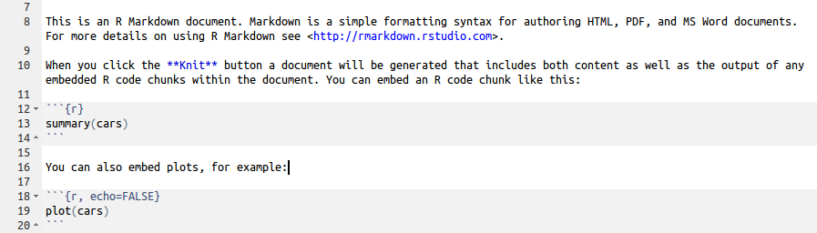

## Reproducible Research


Sidney Harris - New York Times

## What do we mean by Reproducible Research?

- Being able to reproduce your own analysis at a later date
- People from other labs being able to reproduce the analysis
- Useful reference:
http://christophergandrud.github.io/RepResR-RStudio/

##It is a hot topic at the moment

<iframe width="560" height="315" src="https://www.youtube.com/embed/7gYIs7uYbMo" frameborder="0" allowfullscreen></iframe>


##What can we do about it?

- Document early
- Document everything
- Write comments and explanations

##Simple example
- Use the Compile Notebook button in RStudio
- Take an R script and turn into HTML, Word or PDF
- All code will be displayed and the outputs printed
- A compiled report will be generated in your working directory


## Listing version numbers etc

- use the `sessionInfo()` function
- Lets add this to the R scripts and see what happens


## What is going on?

- The `knitr` package is being used convert the R script into 'markdown' format, which it then compiles into the output of your choosing
- `knitr` is distributed with RStudio
    + `knitr` is the modern-day equivalent of `sweave`
- markdown is a 
    + Rmarkdown is the R equivalent
- the following should create the file `rna-seq.Rmd` in your working directory

```{r eval=FALSE}
library(knitr)
spin(hair="rna-seq.R",knit=FALSE)
```

## Defining chunks

- It is not great practice 
- Better to break-up into smaller pieces; '*chunks*'
- You can document each chunk separately
- The characteristics of each chunk can be modified
    + You might not want to print the R code for each chunk
    + or the output
    + etc

## Create a markdown file from scratch

File - > New File - > R Markdown

- Choose 'Document' and the default output type (HTML)
- A new tab is created in RStudio
- The header also you to specify a Page title, author and output type
```{r eval=FALSE}
---
title: "Untitled"
author: "Mark Dunning"
date: "16/06/2015"
output: html_document
---
```

## Format of the file

- **Lines 8 - 10** Plain text description
- **Lines 12 - 14** An R code 'chunk'
- **Lines 18 to 20** Another code chunk, this time producing a plot



- Pressing the ***Knit HTML*** button will create the report
    + Note that you need to 'save' the markdown file before you will see the compiled report in your working directory
    
##Text formatting

- enclose text in \* to format in *italics*
- enclose text in \*\* to format in **bold**
- \*\*\* for ***bold italics***
- \` to format like `code`
- \$ to include equations: $e =mc^2$
- \> quoted text: 

>To be or not to be

- see Markdown Quick Reference for more 
    + adding images
    + adding web links
    + tables

## Chunk options

- It's a good idea to name each chunk
    + Easier to track-down errors
- We can display R code, but not run it
    + `eval=FALSE`
- We can run R code, but not display it
    + `echo=FALSE`
    + e.g. setting display options
- Suppress warning messages
    + `warning=FALSE`

    
## Chunk options: eval

- Sometimes we want to format code for display, but not execute
    + we want to show the code for how we read our data, but want our report to compile quickly

```
'''{r,eval=FALSE}
data <- read.delim("path.to.my.file")
'''
```


## Chunk options: echo

- might want to load some data from disk
    + e.g. the R object from reading the data in the previous slide

```
'''{r echo=FALSE}
load("mydata.rda")
'''
```

## Chunk options: results

```{r results='hide'}
for(i in 1:100){
  print(i)
}
```

##Chunk options: message and warning

- Loading an R package will sometimes print messages and / or warnings to the screen
    + not always helpful in a report
```
'''{r}
library(DESeq)
'''
```

```{r echo=FALSE}
library(DESeq)
```

##Chunk options: message and warning

- Using `message=FALSE` and `warning=FALSE`
```
'''{r message=FALSE,warning=FALSE}
library(DESeq)
'''
```
- Could also need `suppressPackageStartupMessages`


## Including plots

- Use a plotting function (`plot`, `boxplot`, `hist` etc) will include the plot at the relevant point in the document
```
'''{r}
plot(1:10, jitter(1:10))
'''
```

```{r echo=FALSE}
plot(1:10, jitter(1:10))
```

## Control over plots

```
'''{r fig.height=2,fig.align='right'}
plot(1:10, jitter(1:10))
'''
```

```{r echo=FALSE,fig.height=3,fig.align='right'}
plot(1:10, jitter(1:10))
```


## Running R code from the main text

- We can add R code to our main text that is evaluated 

```
.....the sample population consisted of  'r table(gender)[1]' females and 'r table(gender)[2]' males.....
```

```{r echo=FALSE}
gender <- c(rep("F", 47), rep("M", 50))
```
.....the sample population consisted of  `r table(gender)[1]` females and `r table(gender)[2]` males.....


```
.....the p-value of the t-test is 'r pval', which indicates that.....
```
```{r echo=FALSE}
pval <- 0.05
```
.....the p-value of the t-test is `r pval`, which indicates that.....

```
.....After analysis with edgeR, the number of differentially expressed genes is 'r nrow(myresults)'....
```
```{r echo=FALSE}
myresults <- matrix(nrow=1245,ncol=2)
```
.....After analysis with edgeR, the number of differentially expressed genes is `r nrow(myresults)`....


## Running R code from the main text

- Like the rest of our report these R statements will get updated each time we compile the report

```
.....the sample population consisted of  'r table(gender)[1]' females and 'r table(gender)[2]' males.....
```

```{r echo=FALSE}
gender <- c(rep("F", 41), rep("M", 54))
```
.....the sample population consisted of  `r table(gender)[1]` females and `r table(gender)[2]` males.....


```
.....the p-value of the t-test is 'r pval', which indicates that.....
```
```{r echo=FALSE}
pval <- 0.1
```
.....the p-value of the t-test is `r pval`, which indicates that.....

```
.....After analysis with edgeR, the number of differentially expressed genes is 'r nrow(myresults)'....
```
```{r echo=FALSE}
myresults <- matrix(nrow=124,ncol=2)
```
.....After analysis with edgeR, the number of differentially expressed genes is `r nrow(myresults)`....


## Conditional output

```
.....The statistical test was 'r ifelse(pval < 0.05, "", "not")' significant....
```

```{r}
pval <- 0.1
```


The statistical test was `r ifelse(pval < 0.05, "", "not")` significant

```
.....The statistical test was 'r ifelse(pval < 0.05, "", "not")' significant....
```

```{r}
pval <- 0.01
```


The statistical test was `r ifelse(pval < 0.05, "", "not")` significant