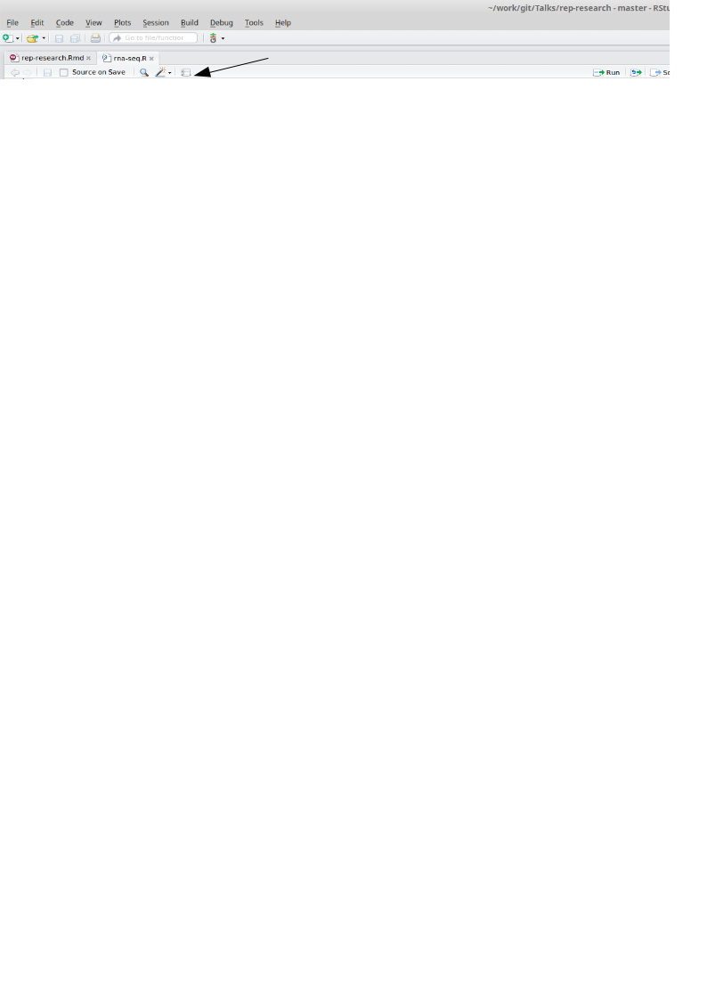

## Principles of Reproducible Research


Sidney Harris - New York Times

## Why should we do reproducible research?

Five selfish reasons - Florian Markowetz [8th July 2015](http://bioinformatics-core-shared-training.github.io/rep-research-masterclass/florian/FlorianTalk.pptx)

1. Avoid disaster
2. Easier to write papers
3. Easier to talk to reviewers
4. Continuity of your work in the lab
5. Reputation


##It is a hot topic at the moment

- Statisticians at MD Anderson tried to reproduce results from a Duke paper and unintentionally unravelled a web of incompetence and skullduggery
    + as reported in the ***New York Times***
    


##Hear the full account

- Very entertaining talk from Keith Baggerly in Cambridge 2010

<iframe width="560" height="315" src="https://www.youtube.com/embed/7gYIs7uYbMo" frameborder="0" allowfullscreen></iframe>


##What can we do about it?

- Use scripts / R
- Use version control
- Document early
- Document everything
- Write comments and explanations
- Automatically-generate your plots, tables, etc from the data
    + always ensure that you have the latest version

##Simple example in RStudio
- See `rna-seq.R`
    + an analysis of a RNA-seq dataset using edgeR
- Use the Compile Notebook button in RStudio
- Take an R script and turn into HTML, PDF or even Word
- All code will be displayed and the outputs printed
- A compiled report will be generated in your working directory




## What is going on?

- The `knitr` package is being used convert the R script into 'markdown' format, which it then compiles into the output of your choosing
- `knitr` is distributed with RStudio
    + `knitr` is the modern-day equivalent of `Sweave`
- markdown is a easy-to-read, easy-to-write text format often used to write HTML, readme files etc
- the following should create the file `rna-seq.Rmd` in your working directory

```{r eval=FALSE}
library(knitr)
spin(hair="rna-seq.R",knit=FALSE)
```

## Not quite enough for a reproducible document

- Minimally, you should record what version of R, and the packages you used.
- use the `sessionInfo()` function
    + e.g. for the version of R I used to make the slides
```{r}
sessionInfo()
```

- Lets add this to the R scripts and see what happens


## Defining chunks

- It is not great practice to have one long, continuous R script
- Better to break-up into smaller pieces; '*chunks*'
- You can document each chunk separately
- Easier to catch errors
- The characteristics of each chunk can be modified
    + You might not want to print the R code for each chunk
    + or the output
    + etc

## Create a markdown file from scratch

File - > New File - > R Markdown

- Choose 'Document' and the default output type (HTML)
- A new tab is created in RStudio
- The header also you to specify a Page title, author and output type
```{r eval=FALSE}
---
title: "Untitled"
author: "Mark Dunning"
date: "16/06/2015"
output: html_document
---
```

## Format of the file

- **Lines 8 - 10** Plain text description
- **Lines 12 - 14** An R code 'chunk'
- **Lines 18 to 20** Another code chunk, this time producing a plot


- Pressing the ***Knit HTML*** button will create the report
    + Note that you need to 'save' the markdown file before you will see the compiled report in your working directory
    
##Text formatting

- enclose text in \* to format in *italics*
- enclose text in \*\* to format in **bold**
- \*\*\* for ***bold italics***
- \` to format like `code`
- \$ to include equations: $e =mc^2$
- \> quoted text: 

>To be or not to be

- see Markdown Quick Reference for more 
    + adding images
    + adding web links
    + tables

## Chunk options

- It's a good idea to name each chunk
    + Easier to track-down errors
- We can display R code, but not run it
    + `eval=FALSE`
- We can run R code, but not display it
    + `echo=FALSE`
    + e.g. setting display options
- Suppress warning messages
    + `warning=FALSE`

    
## Chunk options: eval

- Sometimes we want to format code for display, but not execute
    + we want to show the code for how we read our data, but want our report to compile quickly

```
'''{r,eval=FALSE}
data <- read.delim("path.to.my.file")
'''
```


## Chunk options: echo

- might want to load some data from disk
    + e.g. the R object from reading the data in the previous slide
- your P.I. wants to see your results, but doesn't really want to know about the R code that you used
```
'''{r echo=FALSE}
load("mydata.rda")
'''
```

## Chunk options: results

- Some code or functions might produce lots of output to the screen that we don't need
```{r results='hide'}
for(i in 1:100){
  print(i)
}
```

##Chunk options: message and warning

- Loading an R package will sometimes print messages and / or warnings to the screen
    + not always helpful in a report
```
'''{r}
library(DESeq)
'''
```

```{r echo=FALSE}
library(DESeq)
```

##Chunk options: message and warning

- Using `message=FALSE` and `warning=FALSE`
```
'''{r message=FALSE,warning=FALSE}
library(DESeq)
'''
```
- Could also need `suppressPackageStartupMessages`

##Chunk options: cache

- `cache=TRUE` will stop certain chunks from being evaluate if their code does not change
- speeds-up the compilation of the document
    + we don't want to reload our dataset if we've only made a tiny change downstream
```
'''{r echo=FALSE,cache=TRUE}
load("mydata.rda")
'''
```

## Including plots

- Use a plotting function (`plot`, `boxplot`, `hist` etc) will include the plot at the relevant point in the document
```
'''{r}
plot(1:10, jitter(1:10))
'''
```

```{r echo=FALSE}
plot(1:10, jitter(1:10))
```

## Control over plots

```
'''{r fig.height=2,fig.align='right'}
plot(1:10, jitter(1:10))
'''
```

```{r echo=FALSE,fig.height=3,fig.align='right'}
plot(1:10, jitter(1:10))
```


## Running R code from the main text

- We can add R code to our main text, which gets evaluated
    + make sure we always have the latest figures, p-values etc

```
.....the sample population consisted of  'r table(gender)[1]' females and 'r table(gender)[2]' males.....
```

```{r echo=FALSE}
gender <- c(rep("F", 47), rep("M", 50))
```
.....the sample population consisted of  `r table(gender)[1]` females and `r table(gender)[2]` males.....


```
.....the p-value of the t-test is 'r pval', which indicates that.....
```
```{r echo=FALSE}
pval <- 0.05
```
.....the p-value of the t-test is `r pval`, which indicates that.....

## Running R code from the main text

- Like the rest of our report these R statements will get updated each time we compile the report

```
.....the sample population consisted of  'r table(gender)[1]' females and 'r table(gender)[2]' males.....
```

```{r echo=FALSE}
gender <- c(rep("F", 41), rep("M", 54))
```
.....the sample population consisted of  `r table(gender)[1]` females and `r table(gender)[2]` males.....


```
.....the p-value of the t-test is 'r pval', which indicates that.....
```
```{r echo=FALSE}
pval <- 0.1
```
.....the p-value of the t-test is `r pval`, which indicates that.....


## Conditional output

```{r}
pval <- 0.1
```


```
.....The statistical test was 'r ifelse(pval < 0.05, "", "not")' significant....
```


The statistical test was `r ifelse(pval < 0.05, "", "not")` significant

```{r}
pval <- 0.01
```


```
.....The statistical test was 'r ifelse(pval < 0.05, "", "not")' significant....
```


The statistical test was `r ifelse(pval < 0.05, "", "not")` significant


## Printing vectors
```
The months of the year are 'r month.name'
```

The months of the year are `r month.name`

## Exercise

- You will find a 'template' analysis `pasilla-template.Rmd` in the Day4/rep-research/ folder
- Use this template to report on the analysis of the Pasilla RNA-seq dataset
- Aim for something like`pasilla-analysis.pdf` 
- Once you have a report that you are happy with
    + Modify the report so that single-end samples are used in the analysis
    + Modify your p-value cut-off to 0.01
        + In each case, see how the report changes
        
## References

- Useful reference:
    +  Reproducible Research in R and RStudio
        + http://christophergandrud.github.io/RepResR-RStudio/
        + Useful exercise is to compile the book from the [source code](https://github.com/christophergandrud/Rep-Res-Book)
    + [Implementing Reproducible Research](https://osf.io/s9tya/wiki/home/)